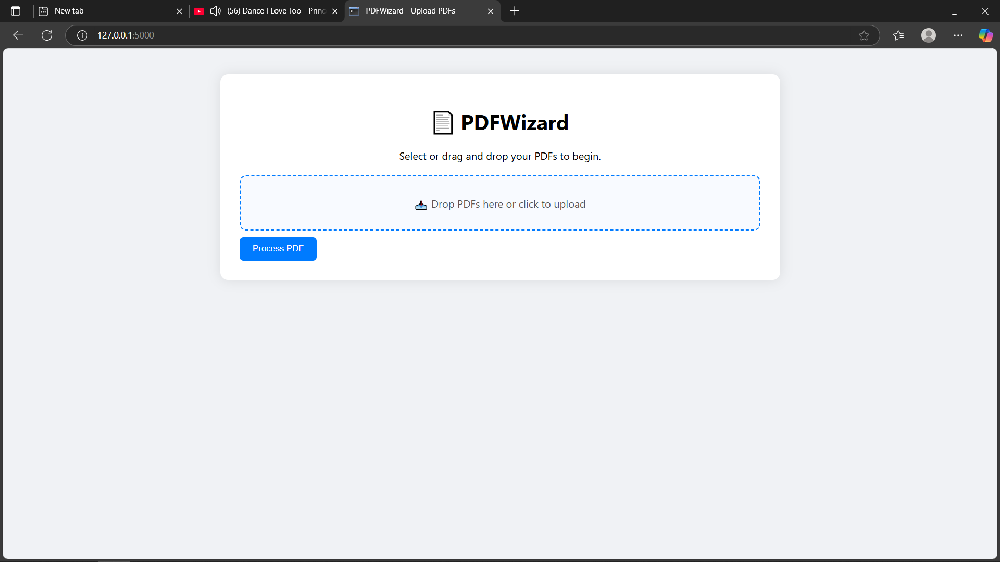
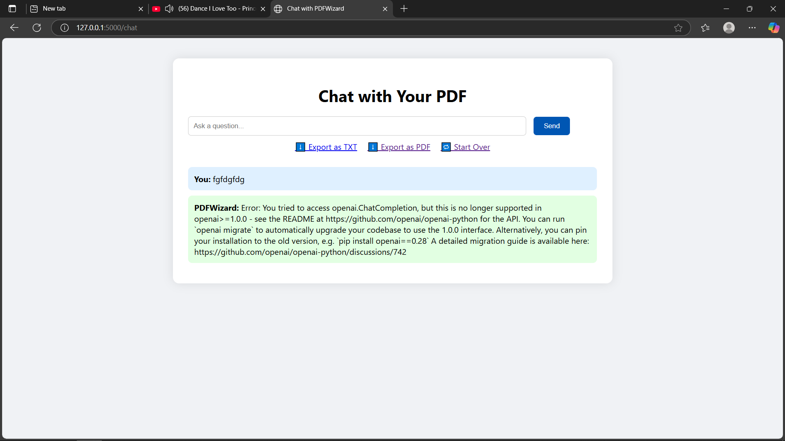

# 📄 PDFWizard

**PDFWizard** is a smart, AI-powered PDF assistant built with Flask. Upload one or more PDFs and chat with them using natural language! Powered by OpenAI's GPT model, PDFWizard can answer your questions using the content of your documents.

---

## ✨ Features

✅ Upload multiple PDFs  
✅ Ask natural language questions about your PDFs  
✅ Remembers previous questions & answers (chat context memory)  
✅ Export full chat history as TXT or PDF  
✅ Drag-and-drop file upload  
✅ Modern, clean UI built with HTML/CSS/JS  
✅ 10MB file size limit per upload  

---

## 🖼 Preview




---

## 🚀 Tech Stack

- **Backend**: Python, Flask  
- **Frontend**: HTML5, CSS3, Vanilla JavaScript  
- **AI**: OpenAI Chat API (GPT-3.5 / GPT-4)  
- **PDF Parsing**: PyMuPDF (`fitz`)  
- **Exporting**: FPDF  

---

## 🛠️ Installation

### 1. Clone the repo

```bash
git clone https://github.com/Nuraj250/pdfwizard.git
cd pdfwizard
```

### 2. Create and activate a virtual environment

```bash
python -m venv venv
source venv/bin/activate  # On Windows use `venv\Scripts\activate`
```

### 3. Install dependencies

```bash
pip install -r requirements.txt
```

### 4. Add your OpenAI API key

Create a `.env` file in the root:

```
OPENAI_API_KEY=your_openai_api_key_here
```

---

## 💡 Usage

### 🔹 Run the app

```bash
python run.py
```

Visit `http://localhost:5000` in your browser.

### 🔹 Upload PDFs

- Drag and drop one or more PDFs or click to select.
- Maximum file size: **10MB**.

### 🔹 Chat

- Ask questions like:
  - “What is the summary of this document?”
  - “What does section 4.3 talk about?”
- The assistant will remember previous interactions.

---

## 📁 Export Chat

On the chat page, you can:

- 💬 Click **“Export as TXT”** to download plain text version
- 📄 Click **“Export as PDF”** to download a PDF of the conversation

---

## 📦 Project Structure

```
pdfwizard/
│
├── app/
│   ├── static/            # CSS & JS
│   ├── templates/         # HTML templates
│   ├── uploads/           # Uploaded PDFs
│   ├── __init__.py        # Flask app setup
│   └── routes.py          # Main routes
│
├── services/
│   ├── pdf_reader.py      # PDF parsing logic
│   └── ai_engine.py       # ChatGPT integration
│
├── .env                   # API keys
├── config.py              # App configs
├── run.py                 # Entry point
└── requirements.txt       # Python dependencies
```

---

## 🧠 Example Questions

- "What is the main topic of this document?"
- "List all action items mentioned."
- "What date is the event scheduled for?"

---

## 📄 License

This project is open-source and free to use. Modify it for your own awesome ideas!

---

## ❤️ Contributing

Got ideas to improve PDFWizard? Open a PR or issue — contributions are welcome!

---

## 👨‍💻 Author

Built with ❤️ by Nuraj
